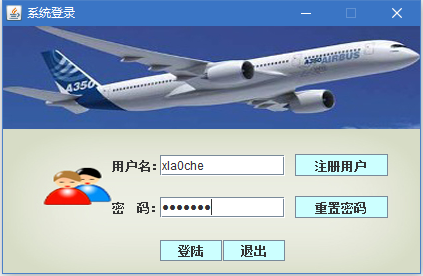
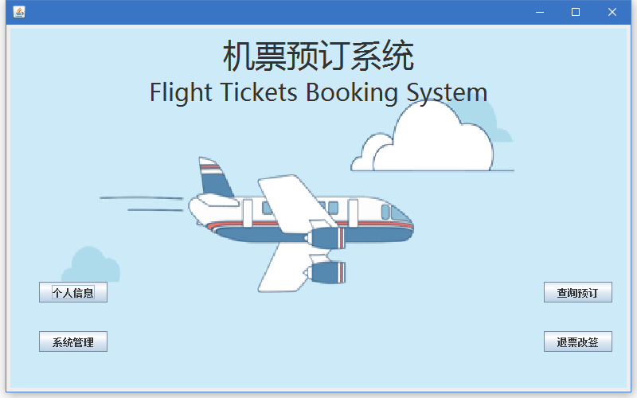
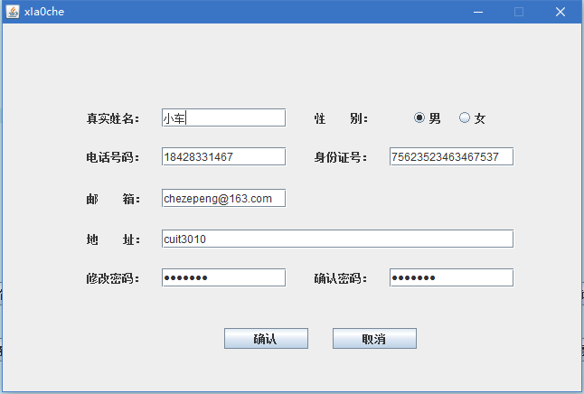
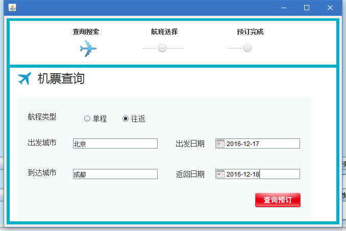
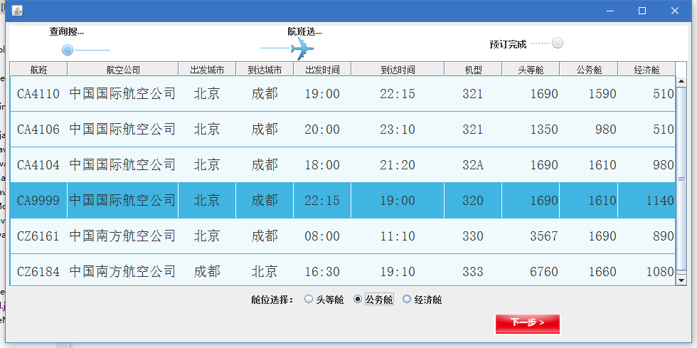
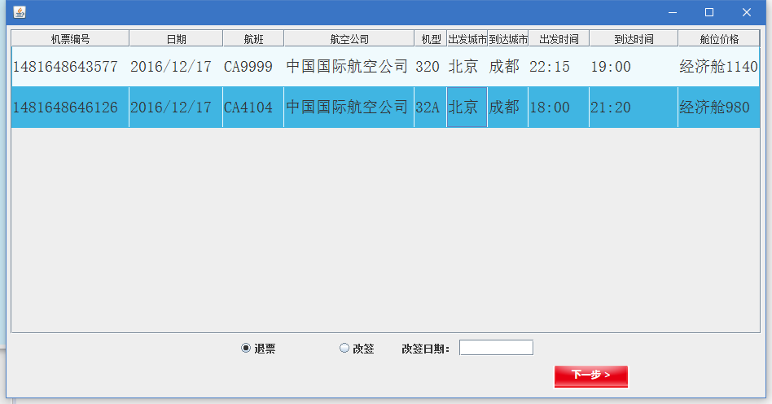
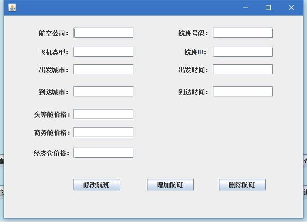

# FlightTicketBookingSystem
A simple java application of booking tickets, which uses swing and oracle with a three-tier architecture.

###Function:
 
1. 用户注册登录，查看修改用户信息
2. 机票查询，预订
3. 退票，改签同一航空公司其他日期的航班
4. 管理员添加修改删除航班

###TODO：
1. 订票，改签界面未选中事件判断
2. 改签事件逻辑
3. 管理员界面清空功能
4. 管理员界面错误输入提示

###数据库创建
数据库用户名：ftbs  
数据库密码：ftbs

##Screencast
####登录界面

####主界面

####个人信息界面

####航班查询界面

####航班显示预订界面

####退票改签界面

####系统管理界面

